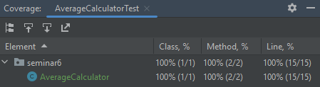

**[Код программы](AverageCalculator.java)**

**[Код тестов](AverageCalculatorTest.java)**

**Отчет Checkstyle**

**Отчет о покрытии тестами**

**Объяснение того, какие сценарии покрыты тестами и почему вы выбрали именно эти сценарии**

>Основные сценарии, которые покрыты тестами:
>- Расчет среднего значения для списка чисел.
>- Сравнение средних значений двух списков и вывод соответствующего сообщения.
>
>Были выбраны данные сценарии, так как они позволяют проверить корректность работы программы и покрыть основные функциональности.